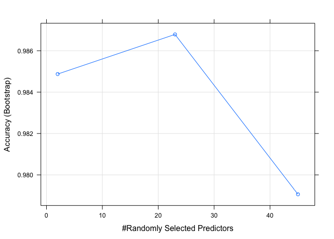

# Predicting the Quality of Barbell Lifts with Accelerometers
Majid  
3rd of July 2016  


## Synopsis

Using devices such as Jawbone Up, Nike FuelBand, and Fitbit it is now possible to collect a large amount of data about personal activity relatively inexpensively. These type of devices are part of the quantified self movement – a group of enthusiasts who take measurements about themselves regularly to improve their health, to find patterns in their behavior, or because they are tech geeks. One thing that people regularly do is quantify how much of a particular activity they do, but they rarely quantify how well they do it. In this project, your goal will be to use data from accelerometers on the belt, forearm, arm, and dumbell of 6 participants. They were asked to perform barbell lifts correctly and incorrectly in 5 different ways (see list beneath). 
More information is available from the website [here](http://groupware.les.inf.puc-rio.br/har (see the section on the Weight Lifting Exercise Dataset).

The barbell lifts are defined as following:
-Class 'A': Unilateral Dumbbell Biceps Curl exactly according to the specification 
-Class 'B': Throwing the elbows to the front
-Class 'C': Lifting the dumbbell only halfway
-Class 'D': Lowering the dumbbell only halfway
-Class 'E': Throwing the hips to the front

The purpose of this report is to build a model and predict the different executions 
of bareball lifts accurately. 

## Setup

We load the following packages and provide the version of the 'caret' package. 


```r
# load packages
library(caret)
library(ggplot2)
library(parallel)
library(doParallel)

# define central seed
centralSeed <- 72353

# switch use saved model or recalculate model
calulateModel <- FALSE

# provide version information for caret package
packageVersion("caret")
```

```
## [1] '6.0.70'
```

## Getting & Cleaning Data

We first download the data from the following URLs into the R session (the orignal
contributor if the data can be found [here](http://groupware.les.inf.puc-rio.br/har (see the section on the Weight Lifting Exercise Dataset) ).


```r
# URLs
urlTraining   <- "https://d396qusza40orc.cloudfront.net/predmachlearn/pml-training.csv"
urlValidation <- "https://d396qusza40orc.cloudfront.net/predmachlearn/pml-testing.csv"

# load data & code 'NA', '' and '#DIV/0!' as missing values
trainData <- read.csv(url(urlTraining), header=TRUE, sep=",", na.strings=c("NA","#DIV/0!",""))
validData <- read.csv(url(urlValidation), header=TRUE, sep=",", na.strings=c("NA","#DIV/0!",""))
```

The cleaning process is applied to training as well as validation data. First 
we subset variables without exploratory content (as name, timestamp...). Then we
extract variables without any missing values (NAs). Further more we transform column
class to numeric except for the prediction variables. We than exclude highly correlated 
variables (with the cut-off 0.9) and check if any variables have zero variance. 
We than center and scale the data with the PreProcess() function. Finally we 
partition the data in a training and test set.


```r
# subset irrelevant columns
trainData <- trainData[, -c(1:7)]
validData <- validData[, -c(1:7)]

# identify variables not containing any NA values
notMissingFilter <- apply(trainData, 2, function(column) !any(is.na(column)))

# subset variables without any NAs
trainData <- trainData[, notMissingFilter]
validData <- validData[, notMissingFilter]

# transform variable class to numeric except for 'classe' & 'problem_id'
numericIndex <- 1:(ncol(trainData)-1)
trainData[, numericIndex] <- apply(trainData[, numericIndex], 2, as.numeric)
validData[, numericIndex] <- apply(validData[, numericIndex], 2, as.numeric)

# identify highly correlated variables to 
highlyCorrelatedIndex <- findCorrelation(cor(trainData[, numericIndex]), cutoff = 0.9)

# exclude highly correlated variables from data
trainData <- trainData[, -highlyCorrelatedIndex]
validData <- validData[, -highlyCorrelatedIndex]

# chech for zero variance variables
zeroVarianceIndex <- nearZeroVar(trainData)
ifelse(length(zeroVarianceIndex) == 0, "No zero variance variables", stop("Found zero variables to subsett"))
```

```
## [1] "No zero variance variables"
```

```r
# preprocess variables 
tempPrepTrain <- preProcess(trainData[, -46],method=c('knnImpute', 'center', 'scale'))
predictedTrain <- predict(tempPrepTrain, trainData[, -46])
predictedTrain$classe <- trainData$classe

tempPrepValid <- preProcess(validData[, -46],method=c('knnImpute', 'center', 'scale'))
predictedValid <- predict(tempPrepValid, validData[, -46])
predictedValid$problem_id <- validData$problem_id

# set seed and partition trainData in test and training set
set.seed(centralSeed)
inTrain <- createDataPartition(y = predictedTrain$classe, p = 0.6, list = FALSE)
training <- trainData[inTrain,] #predictedTrain #!!!
testing  <- trainData[-inTrain,]
```

## Building a Random Forest Model

We will now build our final model using random forest algorithm. To speed up the
calulation we us parallel computing. We print the model with its most important 
variables. Also a plot is rendered showing the relation between the number of major
predictors and accuracy.


```r
# if model should be calculated 
if (calulateModel) {
  
# get available cores
cl <- makeCluster(detectCores() - 1)

# register clusters
registerDoParallel(cl)

# set parallel options for train function
ctrl <- trainControl(classProbs=TRUE,
                     savePredictions=TRUE,
                     allowParallel=TRUE)

# train model
system.time(model_rf <- train(classe ~ ., data = training, method = "rf"))
saveRDS(model_rf, "model_rf.rds")

# save model for re-run
model_rf <- readRDS("model_rf.rds")

# stop parallel computing
stopCluster(cl)
  
} else {
  
# use saved model from previuos calculation 
model_rf <- readRDS("model_rf.rds")

}

# print most important variables
varImp(model_rf)
```

```
## rf variable importance
## 
##   only 20 most important variables shown (out of 45)
## 
##                      Overall
## yaw_belt              100.00
## pitch_forearm          88.09
## pitch_belt             70.75
## magnet_dumbbell_z      69.18
## magnet_dumbbell_y      55.76
## roll_forearm           47.71
## magnet_belt_y          44.77
## magnet_belt_z          30.55
## roll_dumbbell          28.95
## gyros_belt_z           28.67
## accel_dumbbell_y       27.40
## magnet_dumbbell_x      24.36
## accel_forearm_x        23.15
## total_accel_dumbbell   19.60
## accel_dumbbell_z       19.39
## magnet_forearm_z       17.89
## total_accel_belt       17.77
## accel_forearm_z        17.28
## magnet_belt_x          17.22
## yaw_arm                14.35
```

```r
# plot predictors and accuracy
plot(model_rf)
```



## Predict Testing Set

We now predict the test set and inspect the accuracy of the model:


```r
pred_rf  <- predict(model_rf, testing)
predConfMatrix <- confusionMatrix(pred_rf, testing[, 46])
predConfMatrix
```

```
## Confusion Matrix and Statistics
## 
##           Reference
## Prediction    A    B    C    D    E
##          A 2229   26    0    0    0
##          B    0 1490   13    0    0
##          C    1    2 1354   18    0
##          D    1    0    1 1267    5
##          E    1    0    0    1 1437
## 
## Overall Statistics
##                                           
##                Accuracy : 0.9912          
##                  95% CI : (0.9889, 0.9932)
##     No Information Rate : 0.2845          
##     P-Value [Acc > NIR] : < 2.2e-16       
##                                           
##                   Kappa : 0.9889          
##  Mcnemar's Test P-Value : NA              
## 
## Statistics by Class:
## 
##                      Class: A Class: B Class: C Class: D Class: E
## Sensitivity            0.9987   0.9816   0.9898   0.9852   0.9965
## Specificity            0.9954   0.9979   0.9968   0.9989   0.9997
## Pos Pred Value         0.9885   0.9914   0.9847   0.9945   0.9986
## Neg Pred Value         0.9995   0.9956   0.9978   0.9971   0.9992
## Prevalence             0.2845   0.1935   0.1744   0.1639   0.1838
## Detection Rate         0.2841   0.1899   0.1726   0.1615   0.1832
## Detection Prevalence   0.2874   0.1916   0.1752   0.1624   0.1834
## Balanced Accuracy      0.9970   0.9898   0.9933   0.9921   0.9981
```

Finally our model has an overall accuracy of **99.12**.

## Predict Validation 

The prediction for the validation set are the following classes:


```r
data.frame(
  validData$problem_id, 
  classe = predict(model_rf, validData)
)
```

```
##    validData.problem_id classe
## 1                     1      B
## 2                     2      A
## 3                     3      B
## 4                     4      A
## 5                     5      A
## 6                     6      E
## 7                     7      D
## 8                     8      B
## 9                     9      A
## 10                   10      A
## 11                   11      B
## 12                   12      C
## 13                   13      B
## 14                   14      A
## 15                   15      E
## 16                   16      E
## 17                   17      A
## 18                   18      B
## 19                   19      B
## 20                   20      B
```

## Conclusion

With an overall acuracy of 99.12 we found a good solution to predict the quality 
of barbell lifts depending on this data.


